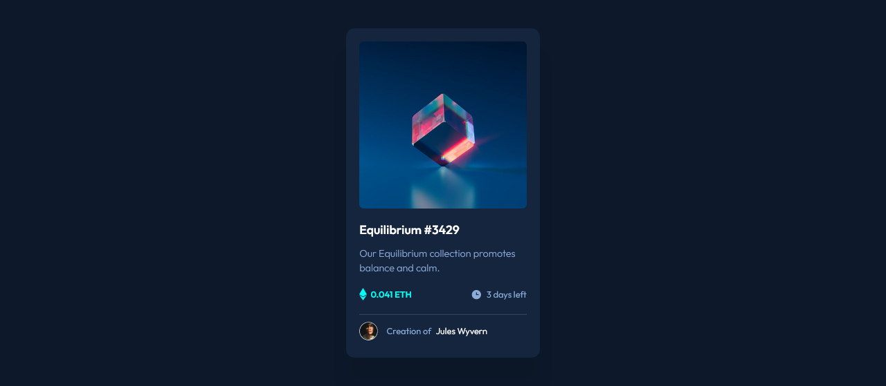

# Frontend Mentor - NFT preview card component solution

This is a solution to the [NFT preview card component challenge on Frontend Mentor](https://www.frontendmentor.io/challenges/nft-preview-card-component-SbdUL_w0U). Frontend Mentor challenges help you improve your coding skills by building realistic projects. 

## Table of contents

- [Overview](#overview)
  - [The challenge](#the-challenge)
  - [Screenshot](#screenshot)
  - [Links](#links)
- [My process](#my-process)
  - [Built with](#built-with)
  - [What I learned](#what-i-learned)
  - [Continued development](#continued-development)
  - [Useful resources](#useful-resources)
- [Author](#author)
- [Acknowledgments](#acknowledgments)

## Overview

### The challenge

Users should be able to:

- View the optimal layout depending on their device's screen size
- See hover states for interactive elements

### Screenshot

### Links

- Solution URL: (https://github.com/Kristina225/My-Frontend-Mentor-Projects/tree/main/nft-preview-card-component-main)
- Live Site URL: [Add live site URL here](https://your-live-site-url.com)

## My process

### Built with

- HTML
- CSS
- Flexbox
- JavaScript

### What I learned

I practiced positioning elements with the 'position' CSS property, as well adjusting the position and better centering elements with the 'translate' property. I also learned about using the 

### Continued development

I need to learn about transitions and transforms before continuing with the next project.

### Useful resources

- [Scalable CSS - BEM CSS naming convention](https://scalablecss.com/bem-quickstart-guide/) - This helped me with finding good names for my CSS classes.

## Author

- Frontend Mentor - [@Kristina225](https://www.frontendmentor.io/profile/Kristina225)
- Twitter - [@KristinaPopovs3](https://twitter.com/KristinaPopovs3)

## Acknowledgments

This is where you can give a hat tip to anyone who helped you out on this project. Perhaps you worked in a team or got some inspiration from someone else's solution. This is the perfect place to give them some credit.

**Note: Delete this note and edit this section's content as necessary. If you completed this challenge by yourself, feel free to delete this section entirely.**
