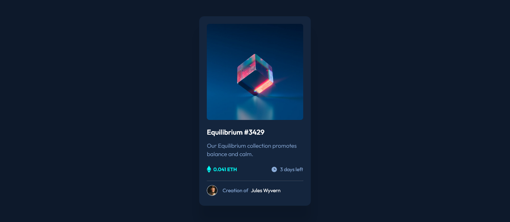

# Frontend Mentor - NFT preview card component solution

This is a solution to the [NFT preview card component challenge on Frontend Mentor](https://www.frontendmentor.io/challenges/nft-preview-card-component-SbdUL_w0U). Frontend Mentor challenges help you improve your coding skills by building realistic projects. 

## Table of contents

- [Overview](#overview)
  - [The challenge](#the-challenge)
  - [Screenshot](#screenshot)
  - [Links](#links)
- [My process](#my-process)
  - [Built with](#built-with)
  - [What I learned](#what-i-learned)
  - [Continued development](#continued-development)
  - [Useful resources](#useful-resources)
- [Author](#author)
- [Acknowledgments](#acknowledgments)

## Overview

### The challenge

Users should be able to:

- View the optimal layout depending on their device's screen size
- See hover states for interactive elements

### Screenshot



### Links

- Solution URL: (https://github.com/Kristina225/My-Frontend-Mentor-Projects/tree/main/nft-preview-card-component-main)
- Live Site URL: [Add live site URL here](https://your-live-site-url.com)

## My process

### Built with

- HTML
- CSS
- Flexbox
- JavaScript

### What I learned

I practiced positioning elements with the 'position' CSS property, as well adjusting the position and better centering elements with the 'translate' property.
I learned how to keep the correct size of my elements on large screens (defined in px or rem) and make them responsive on smaller screens by using setting both 'width' and 'max-width' on my document:
```css
.card {
  width: 100%;
  max-width: 35rem;
}
```
I also learned to add some padding to my body in these projects, so that my layout doesn't break on smaller screens.

### Continued development

I need to learn about transitions and transforms before continuing with the next project.
I also need to start using the Prettier extension in my VS Code editor.

### Useful resources

- [Scalable CSS - BEM CSS naming convention](https://scalablecss.com/bem-quickstart-guide/) - This helped me with finding good names for my CSS classes.

## Author

- Frontend Mentor - [@Kristina225](https://www.frontendmentor.io/profile/Kristina225)
- Twitter - [@KristinaPopovs3](https://twitter.com/KristinaPopovs3)

## Acknowledgments

I would like to thank Frontend Mentor user Yazdun (https://www.frontendmentor.io/profile/Yazdun) for reviewing and helping me improve my solution. His suggestions have been very helpful and beneficial to my learning process.
