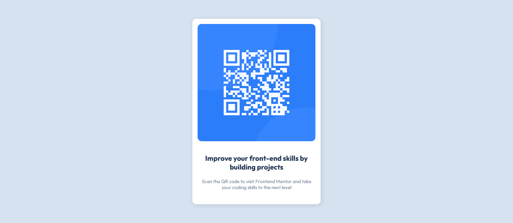

# Frontend Mentor - QR code component solution

This is a solution to the [QR code component challenge on Frontend Mentor](https://www.frontendmentor.io/challenges/qr-code-component-iux_sIO_H). Frontend Mentor challenges help you improve your coding skills by building realistic projects. 

## Table of contents

- [Overview](#overview)
  - [Screenshot](#screenshot)
  - [Links](#links)
- [My process](#my-process)
  - [Built with](#built-with)
  - [What I learned](#what-i-learned)
  - [Continued development](#continued-development)
- [Author](#author)

## Overview

### Screenshot

### Links

- Solution URL: (https://github.com/Kristina225/My-Frontend-Mentor-Projects/tree/main/qr-code-component-main)
- Live Site URL: (https://pm1-qr-code-component-main.netlify.app/)

## My process

### Built with

- HTML
- CSS
- Flexbox

### What I learned

Since this is the first project that I've done, I learned the basics of using git and Github, as well as how to host a website on Netlify. This challenge was a good opportunity to learn how to set up a project. I also had the chance to practice CSS a little bit and use Flexbox.

### Continued development

I need the see what are best practices for coming up with names for classes in my HTML before my next project. I also need to learn how the 'box-shadow' property works.

## Author

- Frontend Mentor - [@Kristina225](https://www.frontendmentor.io/profile/Kristina225)
- Twitter - [@KristinaPopovs3](https://twitter.com/KristinaPopovs3)